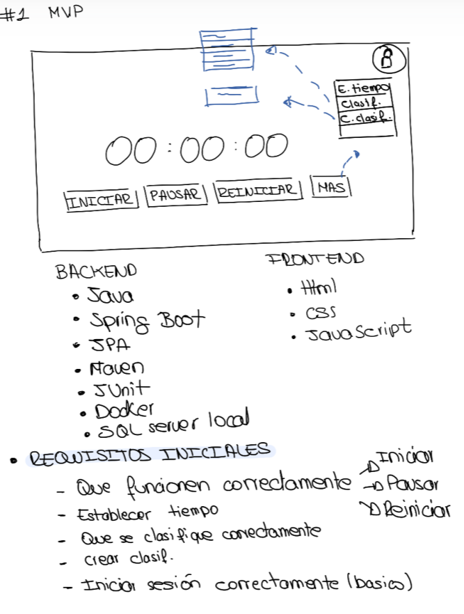
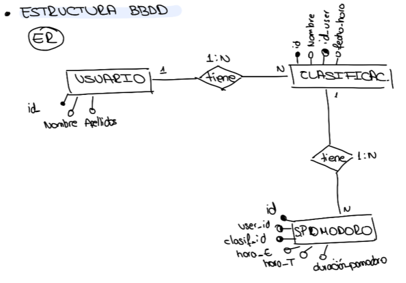

# PomodoroTracker

Aplicación web tipo Pomodoro para registrar sesiones de concentración por categoría y generar estadísticas básicas de uso.

## Alcance del MVP 1

- Temporizador Pomodoro (iniciar / pausar / reiniciar)
- Establecer tiempo de concentración
- Crear y listar clasificaciones (categorías)
- Guardar sesiones Pomodoro completadas (usuario de prueba: user-1)

## Tecnologías

- Backend: Java, Spring Boot, Maven, JPA, JUnit
- Base de datos: SQL Server (local / Docker)
- Frontend: HTML, CSS y JavaScript

## Diseño (borrador)

### Estructura inicial

### Base de datos (diagrama ER)

