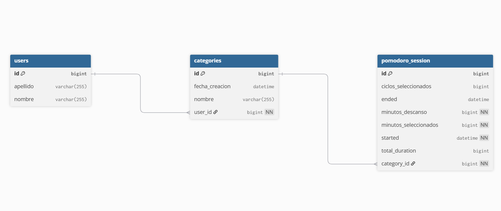

# PomodoroTracker

Aplicación web tipo Pomodoro para registrar sesiones de concentración por categoría y generar estadísticas básicas de uso.

## Alcance del MVP 1

- Temporizador Pomodoro (iniciar / pausar / reiniciar)
- Establecer tiempo de concentración
- Crear y listar categorías
- Guardar sesiones Pomodoro completadas

## Tecnologías

- Backend: Java, Spring Boot, Maven, JPA/Hibernate
- Testing: JUnit y Mockito
- Base de datos: MySQL
- Frontend: HTML, CSS y JavaScript
- Dockerización: BD y APP

## Diseño (borrador)

### Estructura inicial

### Base de datos (diagrama ER)

